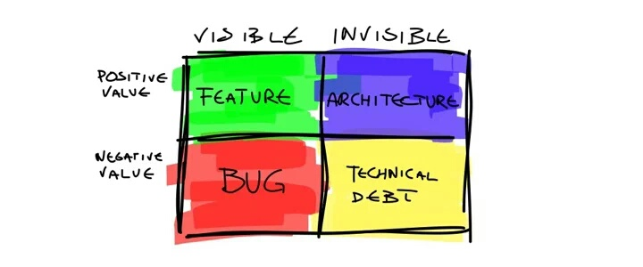

Xeito: Palabra en Gallego; hacer las cosas con xeito es hacer las cosas bien y con rigor y arte. Vamos, no hacer trapalladas. Sedme xeitosos siempre.

Talk is cheap. Show me the code
— Linus Torvalds

Divide y venceras.

The best approach when you apply “Clean Architecture” is to use common sense. (KISS)

There are only two hard things in Computer Science: cache invalidation and naming things.
— Phil Karlton

Ask a programmer to review 10 lines of code, he'll find 10 issues. Ask him to do 500 lines and he'll say it looks good.

El código es como un chiste, si lo explicas es malo.

Any fool can write code that a computer can understand. Good programmers write code that humans can understand (Escribes una vez, lees src cuatro veces.)
— Martin Follen.

There are only two kinds of languages, the ones people complain about, and the ones nobody uses
— Bjarne Stroustrup

Complexity is like a bug light for smart people. We can't resist it, even though we know it's bad for us.

Junior programmers create simple solutions to simple problems. Senior programmers create complex solutions to complex problems. Great programmers find simple solutions to complex problems. 
— Charles Connell

La comunidad te devuelve con creces los que les das.

Always leave the campground cleaner than you found it [Ser un buen boyscout, recoge la mierda de otros].
— Boy Scouts rule

A goal is a dream with a deadline.
— Napoleon Hill

Work expands so as to fill the time available for its completion
— Parkinson's law

Some people, when confronted with a problem, think “I know, I’ll use regular expressions.” Now they have two problems
— Jamie Zawinski, on comp.lang.emacs [*]

`python -m this`
— Guido van Rossum

Las empresas piensan: "!Ah, sois ágiles! Eso quiere decir que lo haceis rápido". Y no, no es eso. Ágil quiere decir que lo hacemos bien"
— Pepe Doval

I) Put people before code, II) Make progress before you get consensus, III) Problems before solutions, IV) Contracts before internals
— Pieter Hintjens

If your software developers are able to accurately estimate how long something will take, you should fire them. If they've done something so many times before that they know exactly how long it'll take them to do it again, then they should have made a reusable solution by now.

Community > Docs > Code
— Fabien Potencier

A complex system that works is invariably found to have evolved from a simple system thot worked. A complex system designed from scratch never works and cannot be patched up to make it work. You have to start over with a simple system.
— John Gall

Rewrites only work if the people involved in the 1.0 are also involved in the 2.0, and thus have the benefit of context + history and understand the accidental complexity in the old system. Otherwise, you end up with a second, different 1.0.
— @kyleve

Cuando un sistema está en producción cuesta horrores sacarlo de ahí (preguntadle a los bancos)
- @javisantana

More: https://twitter.com/CodeWisdom

Latency numbers every programmer should know
----------------------------------------------

    L1 cache reference ......................... 0.5 ns                 x 10^6 = 0.5 s
    Branch mispredict ............................ 5 ns                 x 10^6 = 5 s
    L2 cache reference ........................... 7 ns                 x 10^6 = 7 s
    Mutex lock/unlock ........................... 25 ns                 x 10^6 = 25 s
    Main memory reference ...................... 100 ns                 x 10^6 = 100s
    Compress 1K bytes with Zippy ............. 3,000 ns  =   3 µs       x 10^6 = 50 min
    Send 2K bytes over 1 Gbps network ....... 20,000 ns  =  20 µs       x 10^6 = 5.5 hr
    SSD random read ........................ 150,000 ns  = 150 µs       x 10^6 = 1.7 days
    Read 1 MB sequentially from memory ..... 250,000 ns  = 250 µs       x 10^6 = 2.9 days
    Round trip within same datacenter ...... 500,000 ns  = 0.5 ms       x 10^6 = 5.8 days
    Read 1 MB sequentially from SSD* ..... 1,000,000 ns  =   1 ms       x 10^6 = 11.6 days
    Disk seek ........................... 10,000,000 ns  =  10 ms       x 10^6 = 16.5 weeks
    Read 1 MB sequentially from disk .... 20,000,000 ns  =  20 ms       x 10^6 = 7.8 months
    Send packet CA->Netherlands->CA .... 150,000,000 ns  = 150 ms       x 10^6 = 4.8 years

Estimation
----------

* http://coding.abel.nu/2012/06/programmer-time-translation-table
* https://blogs.dropbox.com/tech/2015/10/what-do-you-mean-you-need-more-time/

Langs
-----

* http://hyperpolyglot.org/
* http://githut.info
* http://www.tiobe.com/index.php/content/paperinfo/tpci/index.html
* http://redmonk.com/sogrady/2018/03/07/language-rankings-1-18/
* http://cwe.mitre.org/top25/
* http://ideone.com

Licenses and versions
---------------------

* http://choosealicense.com/
* https://spdx.org/licenses/
* http://semver.org/

Benchmarks
----------

* http://www.techempower.com/benchmarks/
* https://benchmarksgame-team.pages.debian.net/benchmarksgame/
* https://tech.marksblogg.com/benchmarks.html

ASCII
-----

* http://asciiflow.com/
* http://www.figlet.org
* https://ivanceras.github.io/elm-examples/elm-bot-lines/
* http://aa-project.sourceforge.net/aalib/
* telnet towel.blinkenlights.nl

QA
--

* http://www.catb.org/esr/faqs/smart-questions.html
* http://www.chiark.greenend.org.uk/~sgtatham/bugs.html
* https://medium.com/@fesja/10-skills-you-must-have-to-be-a-great-qa-40ee58232599#.sqdeviiap
* http://fantasai.inkedblade.net/style/talks/filing-good-bugs/
* https://github.com/minimaxir/big-list-of-naughty-strings

JUNIOR
------

* https://gallir.wordpress.com/2016/03/24/el-mejor-consejo-que-puedo-dar-a-un-joven-ingeniero/
* http://mailchi.mp/bonillaware/10-cosas-que-me-hubiera-gustado-saber-cuando-empec-en-esto-bonilista
* https://www.cs.helsinki.fi/u/luontola/tdd-2009/ext/ObjectCalisthenics.pdf
* http://pythontutor.com/

Other
-----

* Monads: http://blog.plover.com/prog/burritos.html and https://philipnilsson.github.io/Badness10k/escaping-hell-with-monads/
* Async: http://journal.stuffwithstuff.com/2015/02/01/what-color-is-your-function/
* https://www.enterpriseready.io/ ([src](https://github.com/enterpriseready/enterpriseready)) (+i18n +a11y)
* https://www.joelonsoftware.com/2000/08/09/the-joel-test-12-steps-to-better-code/
* https://12factor.net/
